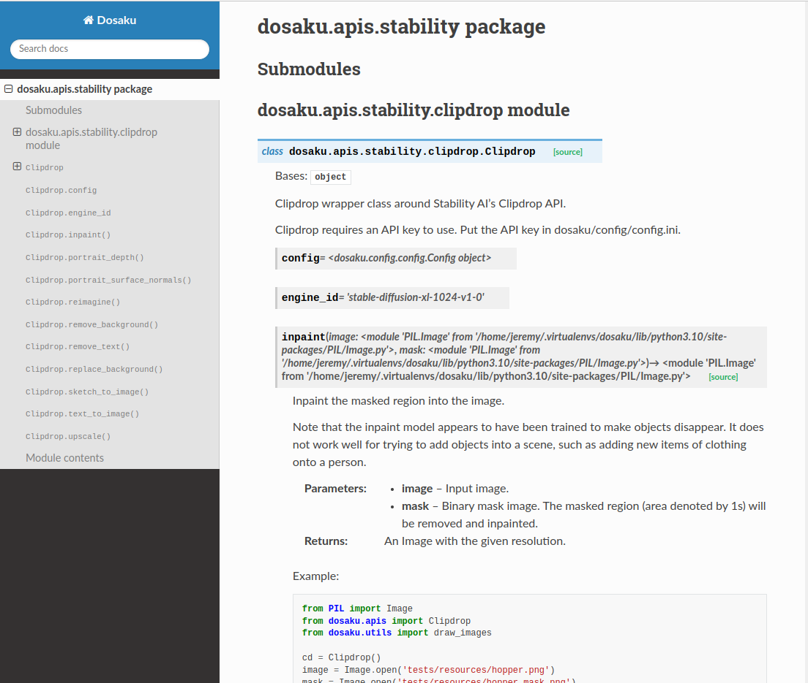

# Contributing

If you have an idea or feature you would like to add, or generally would like get involved, you are highly encouraged to 
contribute!

## General Process

If you would like to contribute, do the following:

1. **Tell someone.** Message an active contributer and briefly discuss the idea with them. The easiest way to find 
someone is to head to our discord and shout out to someone.
2. **Make an issue.** Make a github issue to help people track your progress.
3. **Fork Dosaku.** Fork Dosaku to your own repo. 
4. **Create feature.** Create a new feature branch. Create all the cool things related to your new feature.
5. **Create unit tests.** Make sure to add unit tests to make sure your feature works properly.
6. **Pylint your code.** Run pylint on your code. It should pass with 100%.
7. **Add documentation.** Document your code and build the docs. Make sure your documentation shows up correctly.
8. **Merge.** Git fetch the most up-to-date develop branch. Merge your code into develop.
9. **Make a pull request.** Make a pull request to pull your code into develop.
10. **Make changes.** If there are any changes to make, repeat the previous steps and make another pull request.

Once your pull request is accepted, it will be merged into the develop branch and pulled into main with the next 
scheduled release. Released versions get pushed to PyPI, after which `pip install dosaku` will show your new feature to 
the world.

## Step-by-step Instructions

### Install the dev requirements

In addition to the standard Dosaku requirements, you will also need to install the dev requirements:

```commandline
pip install -r dev_requirements.txt
```

### Coding Style

Please read through and use the [Google style guide](https://github.com/google/styleguide) for all code, namely the
[python guide](https://google.github.io/styleguide/pyguide.html) for python code. This format is the one we use for 
documentation generation. To check your Python changes please use [pylint](https://github.com/pylint-dev/pylint).

### Unit Tests

Follow the pre-existing format to add pytest unit tests for your code. Aim for 100% code coverage (statement coverage) 
and test as many usage conditions as possible. I.e. upon running your unit tests, every line of your code should run at 
least once, and all common usage cases should be tested, including any corner cases.

To run the unit tests with code coverage statistics, run the following from the repo root directory:

```commandline
pytest --cov=dosaku --cov-report term-missing tests
```

Note: running *all* the tests may take some time and require some rather beefy (24gb x2 GPUs) that you do not have. In 
this case just run the unit tests for your new code and mention the fact to the person assigned to accept your pull 
request. They will then be responsible for running *all* the unit tests to make sure they still pass.

### Pylint

We use pylint to check our code for style and consistency. It is generally best to install it through pip. We include it
in our *requirements.txt* file, so if you've installed those you already have it, though you likely still need to add 
its binary to your PATH variable. To check, run the following command:

```commandline
pylint --version
```

If `pip freeze` shows pylint is installed, but the `pylint` command does not work, it probably means you need to add the
location where pip installs binaries to your PATH variable. Open your bashrc file (`nano ~/.bashrc`) and add the 
following line at the bottom:

```commandline
export PATH=$PATH:/home/user/.local/bin
```

Save and close the file, then run `source ~/.bashrc` to make the changes take effect. The `pylint` command should now 
work.

### Documentation

Document your code in accordance with the Google style guide above. If in doubt, just follow the format you see used 
around Dosaku already.

To build the docs, do the following from the root directory:

```commandline
sphinx-apidoc --force -o docs dosaku/
cd docs
make clean html
```

A new directory [docs/_build](./docs/_build) should appear, containing our html documentation. Opening it (*index.html*)
in a browser, you should find something similar to the following:



If you document your code accordingly, it should automatically appear in the docs. If you want to edit the 
documentation more substantially, have a gander at the [doc's docs](https://www.sphinx-doc.org/en/master/).

